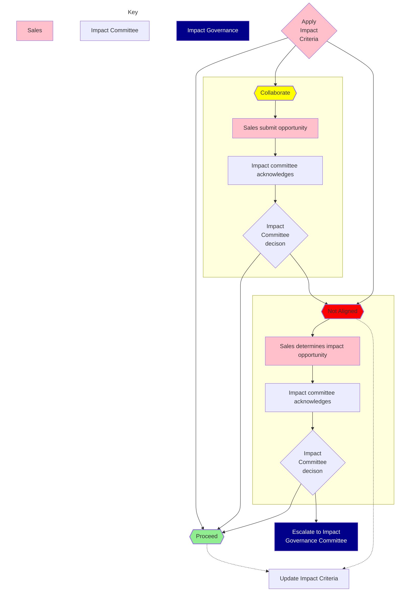
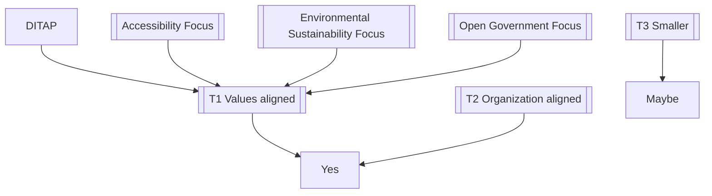

# Impact Direction for Sales

There are multiple ways to think about how to apporach this.

## Agency Workflow 2

```mermaid
flowchart TD
    ApplyCriteria{"Apply\nImpact\nCriteria"}
    ApplyCriteria-->Proceed{{Proceed}};
    ApplyCriteria-->Collaborate{{Collaborate}};
    ApplyCriteria-->NotAligned{{"Not Aligned"}};
    subgraph CollaborateWorkflow [" "]
        Collaborate-->SalesSubmits["Sales submit opportunity"]
        SalesSubmits-->ImpactResponds["Impact committee acknowledges"];
        ImpactResponds-->Decision{"Impact\nCommittee\ndecison"};
    end;
    Decision-->Proceed;
    Decision-->NotAligned;

    subgraph NotAlignedWorkflow [" "]
        NotAligned-->SalesSubmitsImpactRed["Sales determines impact opportunity"]
        SalesSubmitsImpactRed-->ImpactRespondsRed["Impact committee acknowledges"];
        ImpactRespondsRed-->ImpactDiscussesRed{"Impact\nCommittee\ndecison"};
    end;
    ImpactDiscussesRed-->Proceed;
    ImpactDiscussesRed-->InvolveGovernanceRed[Escalate to Impact\nGovernance Committee]
    Proceed-.->UpdateCriteria["Update Impact Criteria"];
    NotAligned-.->UpdateCriteria;

    subgraph Key
        direction LR;
        Sales ~~~ ImpactCommittee["Impact Committee"] ~~~ ImpactGovernance["Impact Governance"];
    end;

style Proceed fill:lightgreen,stroke-width:2px;
style Collaborate fill:yellow,stroke-width:2px;
style NotAligned fill:red,stroke-width:2px;

style Sales fill:pink;
style ApplyCriteria fill:pink;
style SalesSubmits fill:pink;
style SalesSubmitsImpactRed fill:pink;

style InvolveGovernanceRed fill:darkblue,color:white;
style ImpactGovernance fill:darkblue,color:white;
style Key fill:none,stroke:none;
```

## Values workflow 2

```mermaid
graph TD
   DITAP-->Tier1;
   Accessibility[[Accessibility Focus]]-->Tier1;
   Sustainability[[Environmental Sustainability Focus]]-->Tier1;
   Open[[Open Government Focus]]-->Tier1;
   Tier1[[T1 Values aligned]]-->Yes;
   Tier2[[T2 Organization aligned]]-->Yes
   Tier3[[T3 Smaller]]-->Maybe
```

## Values workflow 3

```mermaid
graph TD
   DITAP-->Tier1;
   Accessibility[[Accessibility Focus]]-->Tier1;
   Sustainability[[Environmental Sustainability Focus]]-->Tier1;
   Open[[Open Government Focus]]-->Tier1;
   Tier1[[T1 Values aligned]]-->Yes;
   Tier2[[T2 Organization aligned]]-->Yes
   Tier3[[T3 Smaller]]-->Maybe
```
